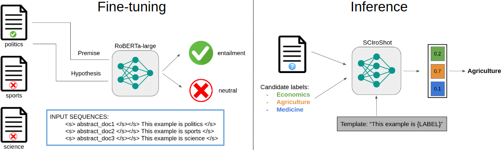

# SCIroShot ⚛️

SCIroShot is an entailment-based zero-shot text classifier that has been trained on a weakly supervised dataset of scientific data originally gathered from [Microsoft Academic Graph](https://www.microsoft.com/en-us/research/project/microsoft-academic-graph/).

This is the official repository for the paper "[*A weakly supervised textual entailment approach to zero-shot text classification*](https://aclanthology.org/2023.eacl-main.22.pdf)", published in the EACL 2023 conference.



## 📖 How to use
```python
from transformers import pipeline

zstc = pipeline("zero-shot-classification", model="BSC-LT/sciroshot")

sentence = "Leo Messi is the best player ever."
candidate_labels = ["politics", "science", "sports", "environment"]
template = "This example is {}"

output = zstc(sentence, candidate_labels, hypothesis_template=template, multi_label=False)

print(output)
print(f'Predicted class: {output["labels"][0]}')
```


## 📝 Results

### Scientific domain

| Model | arXiv | SciDocs-MesH | SciDocs-MAG | Konstanz | Elsevier | PubMed |
|-------|-------|--------------|-------------|----------|----------|--------|
| [fb/bart-large-mnli](https://huggingface.co/facebook/bart-large-mnli) | 33.28 | **66.18**🔥 | 51.77 | 54.62 | 28.41 | **31.59**🔥 |
| SCIroShot | **42.22**🔥 | 59.34 | **69.86**🔥 | **66.07**🔥 | **54.42**🔥 | 27.93 |

### General domain
| Model | Topic | Emotion | Situation |
|-------|-------|---------|-----------|
| RTE [(Yin et al., 2019)](https://arxiv.org/pdf/1909.00161.pdf) | 43.8 | 12.6 | **37.2**🔥 |
| FEVER [(Yin et al., 2019)](https://arxiv.org/pdf/1909.00161.pdf) | 40.1 | 24.7 | 21.0 |
| MNLI [(Yin et al., 2019)](https://arxiv.org/pdf/1909.00161.pdf) | 37.9 | 22.3 | 15.4 |
| NSP [(Ma et al., 2021)](https://aclanthology.org/2021.acl-short.99.pdf) | 50.6 | 16.5 | 25.8 |
| NSP-Reverse [(Ma et al., 2021)](https://aclanthology.org/2021.acl-short.99.pdf) | 53.1 | 16.1 | 19.9 |
| SCIroShot | **59.08**🔥 | **24.94**🔥 | 27.42

## 📣 Citation
```
@inproceedings{pamies-etal-2023-weakly,
    title = "A weakly supervised textual entailment approach to zero-shot text classification",
    author = "P{\`a}mies, Marc  and
      Llop, Joan  and
      Multari, Francesco  and
      Duran-Silva, Nicolau  and
      Parra-Rojas, C{\'e}sar  and
      Gonzalez-Agirre, Aitor  and
      Massucci, Francesco Alessandro  and
      Villegas, Marta",
    booktitle = "Proceedings of the 17th Conference of the European Chapter of the Association for Computational Linguistics",
    month = may,
    year = "2023",
    address = "Dubrovnik, Croatia",
    publisher = "Association for Computational Linguistics",
    url = "https://aclanthology.org/2023.eacl-main.22",
    pages = "286--296",
    abstract = "Zero-shot text classification is a widely studied task that deals with a lack of annotated data. The most common approach is to reformulate it as a textual entailment problem, enabling classification into unseen classes. This work explores an effective approach that trains on a weakly supervised dataset generated from traditional classification data. We empirically study the relation between the performance of the entailment task, which is used as a proxy, and the target zero-shot text classification task. Our findings reveal that there is no linear correlation between both tasks, to the extent that it can be detrimental to lengthen the fine-tuning process even when the model is still learning, and propose a straightforward method to stop training on time. As a proof of concept, we introduce a domain-specific zero-shot text classifier that was trained on Microsoft Academic Graph data. The model, called SCIroShot, achieves state-of-the-art performance in the scientific domain and competitive results in other areas. Both the model and evaluation benchmark are publicly available on HuggingFace and GitHub.",
}
```

## 📫 Contact

For further information, please contact <langtech@bsc.es>.

## ⚖️ License

This work is distributed under a [Apache License, Version 2.0](https://www.apache.org/licenses/LICENSE-2.0).
